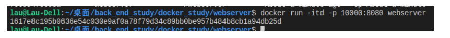

# <cente>Docker 学习</center>

### 1. Docker

#### 1.1 Docker的概念

Docker是一个应用容器引擎，可以允许开发者讲应用打包到一个可以移植的容器（镜像）中，然后发布到linux内核的机器上。

docker的优势：

- 容器和容器之间相互独立，可以更好地针对模块进行操作。
- Docker 在容器的基础上，进行了进一步的封装，从文件系统、网络互联到进程隔离等等，极大的简化了容器的创建和维护，使得 Docker 技术比虚拟机技术更为轻便、快捷。
- 可以更高效地利用系统资源
- 更快速的启动时间
- 移植后运行环境的一致性...

学习了Docker之后，我对他的可移植性和独立性有了更深入的理解，并通过自己写的web应用，部署到docker上测试运行，并进行版本库的使用，更深入地认识了这个开源的工具。

- 镜像
- 容器

在学习的过程中，我认识到了Docker服务的两个非常重要的概念：容器和镜像。

镜像更像是代码，是静态的对象，结合后面的的dockerhub可以类比为git提交的commit 内容。它相当于一个个版本，也可以看做一个个的备份，镜像与容器可以比作类和实例化对象。由于镜像是静态的，和镜像相对的就是在运行中的容器，容器是动态对象，可以由静态的容器生成，并进行测试，进行改动后可以从容器commit生成镜像，作为一个版本的保存。

在学习过程中了解到了Docker网络的部署，可以同时运行多个容器，并建立网络，让他们之间相互信息协作。镜像之间的关联也可以体现在新建创造容器的过程中，一个容器可以由多个镜像关联生成：如服务端与mysql数据库的关联。

有了Docker，就可以把本地编写好的go客户端，模块化并装载到Docker容器内部，再利用它的优势——可移植性，部署到linux内核云服务器上。Docker的封装使得这个过程十分便捷。

#### 1.2 Docker的安装以及基本使用

安装过程可以参考

https://www.runoob.com/docker/ubuntu-docker-install.html

安装成功之后，可以从官方平台拉取Hello-world程序进行测试。


通过学习感觉docker的社区与github十分相似。

因为在国内网络，拉取的过程可能出现网速及其缓慢的情况，可以通过在/etc/docker/daemon.json文件下新建daemon.json文件，并设置如下镜像源，使用国内镜像源的方式进行加速.

```
{
  "registry-mirrors": ["http://hub-mirror.c.163.com"]
}
```

#### 1.3 简单服务的部署

1. 本地服务测试

我在本地编写了一个简单的golang web 服务：

```
func addHandler(w http.ResponseWriter, req *http.Request) {
	vars := mux.Vars(req)
	id1 := vars["id1"]
	id2 := vars["id2"]
	...
	formatter.JSON(w, http.StatusOK, struct{ Test string }{id1 + " + " + id2 + " = " + id_str})
}
```

可以通过对两个url传入参数的数值进行加和，并以json的格式返回给客户端加和的结果。

本地测试


可看到服务端返回正确结果。

2. DockerFile的编写

DockerFile语法学习过程参考https://www.cnblogs.com/dance-walter/p/9581508.html

我的体会是，DockerFile的作用是告诉了Docker如何通过一个本地的服务，构建起来一个可以运行的Docker镜像，并将这个对象保存在当前用户的仓库中。

其中几个非常重要的关键字

- FROM：通过已经存在的一个基础镜像进行构造；
- ADD：将文件进行拷贝移动
- RUN：执行指令
- ENTRYPOINT：指向默认的运行程序。

在我搭建Docker镜像的过程中就主要运用了以上关键字。

最初我打算通过讲源代码COPY到镜像内部，再进行编译，但是由于依赖拉取的原因，这样做会十分麻烦，而我部署Docker的目的是封装和简化，所以我在本地编译之后，直接将可执行程序部署到Docker内部，这样只需要将编译好的程序ADD到镜像内部的目录就可以了。

```
FROM ubuntu:latest
ADD webserver /
EXPOSE 8000
ENTRYPOINT ["/webserver"]
```

将我编译好的webserver可执行程序拷贝到镜像\目录下，并设置为默认程序。

3. 使用docker build指令，通过dockerFile创建指定镜像

   由于上述使用的基础docker镜像为Ubuntu，首先需要pull下来这个镜像：

   ```
   $ docker search ubuntu #查找镜像
   $ docker pull ubuntu      #拉取镜像
   ```

   之后可以在`$ docker images`指令下找到本地镜像Ubuntu

   

   在服务目录下，运行`$ docker build -t webserver .`

   在控制台可以看到对于DockerFile的每一步指令进行执行的结果，在这里可能会出现错误。比如如果这里存在Build编译指令，则可能出现因为依赖拉取的问题导致编译失败。

   

   可以在当前目录下，创建名为webserver的镜像

   

4. 运行依赖于这一镜像的容器

   运行可以有很多方式，比如后台运行、进入命令行交互、后台运行并进入命令行等等。进入命令行后可以输入exit退出，退出后也可以输入docker exec 回到命令行。退出后可以docker stop暂停这一容器，或者删除容器，删除之前一定要保证容器暂停状态。

   关于容器状态存在七种：reated（已创建） restarting（重启中） running（运行中） removing（迁移中） paused（暂停） exited（停止） dead（死亡）

   由于我的镜像server存在端口的指定，在运行时需要指定容器的端口映射，我将容器内部的8080端口映射为外部的10000端口，由于不需要进行命令行交互，所以使用后台运行如下：

   

   可看到返回哈希串为这个容器的独有ID，使用localhost:10000端口进行测试如下

   

   可以在docker后台logs查看当前请求日志

   

#### 1.4 Docker容器文件系统操作

我认为Docker神奇的一点在于它十分轻量级、但有自己的文件系统，可以兼容任何主流linux平台，所以对于这个简易linux文件系统的数据操作显得十分便捷，完全可以使用服务容器自己的文件系统进行服务提供。

1. 设计文件服务

如下小型文件读写服务：

```
func saveIdHandler(w http.ResponseWriter, req *http.Request) {
	vars := mux.Vars(req)
	id := vars["id"]
	...
	if err := ioutil.WriteFile("storage.txt", []byte(id), 0777); err != nil {
		fmt.Println(err)
		formatter.JSON(w, http.StatusOK, err)
		return
	}
	formatter.JSON(w, http.StatusOK, struct{ Test string }{id})
}
```

可以将传入参数写入磁盘文件`storage.txt`内，使用go 语言os.ioutil的接口进行实现。

2. 更新镜像

一开始进行实验的过程中，使用原始tag进行镜像的生成，会使得之前镜像的tag值变为none，在镜像占据空间很大的情况下非常浪费空间，所以需要在更改前删除旧版镜像。

```
$ docker rmi 1617 -f 
```

-f表示将所有依赖删除。

再次进行镜像生成。

```
3. 测试镜像
```

这次由于观测是否将信息写入容器，需要使用命令行进行观测。我发现这个轻量级linux内部没有任何已经安装好的编辑器，只能自己`apt update`后安装vim编辑器。但在后续的测试中发现这并不是永久化的，在容器文件系统中做出的任何改动，即使commit到本地镜像文件内，再次打开依旧恢复原状，如需测试软件则需要重新安装。所以commit保存的都是针对于DockerFile做出的改动，而对于其他动态的改动并没有持久化。

后台模式运行容器


进入后台容器的命令行


访问/save/6666进行测试


运行`$ vim storage.txt`可以看到正确写入结果


在docker容器内读写测试成功


#### 1.5 使用DockerHub平台进行分享以及版本控制

DockerHub平台和github平台非常相似，便于版本提交管理和共享。

可以将刚刚我创建的镜像发布到我的DockerHub云仓库内。

在发布之前需要更改镜像的tag，保证镜像tag为 我的DockerHub用户名/镜像名，否则会发布失败。


更改镜像名之后，push到云端。


可在DockerHub网站上看到新建的分支


#### 1.6 与mysql容器关联,搭建Mysql挂载数据卷

对于需要用到mysql接口的数据库操作，增加命令 `--link mysql:mysql` 让 容器与 `Mysql` 容器互联；通过 `--link`，**可以在容器内直接使用其关联的容器别名进行访问**，而不通过IP，

##### 在docker容器上挂载数据卷，从而实现数据库和容器的分离，数据库单独管理。

```
docker run --name mydbserver -p 3360:3306 -e MYSQL_ROOT_PASSWORD=1234 -v /data/docker-mysql:/var/lib/mysql -d
```


可以进入docker容器命令行，查看对应的路径下的sql数据库文件


这时，运行goserver程序，连接到docker数据库，并根据url参数进行数据库操作。


可在数据库bench中看到对应接口3360的服务器内数据出现改变


